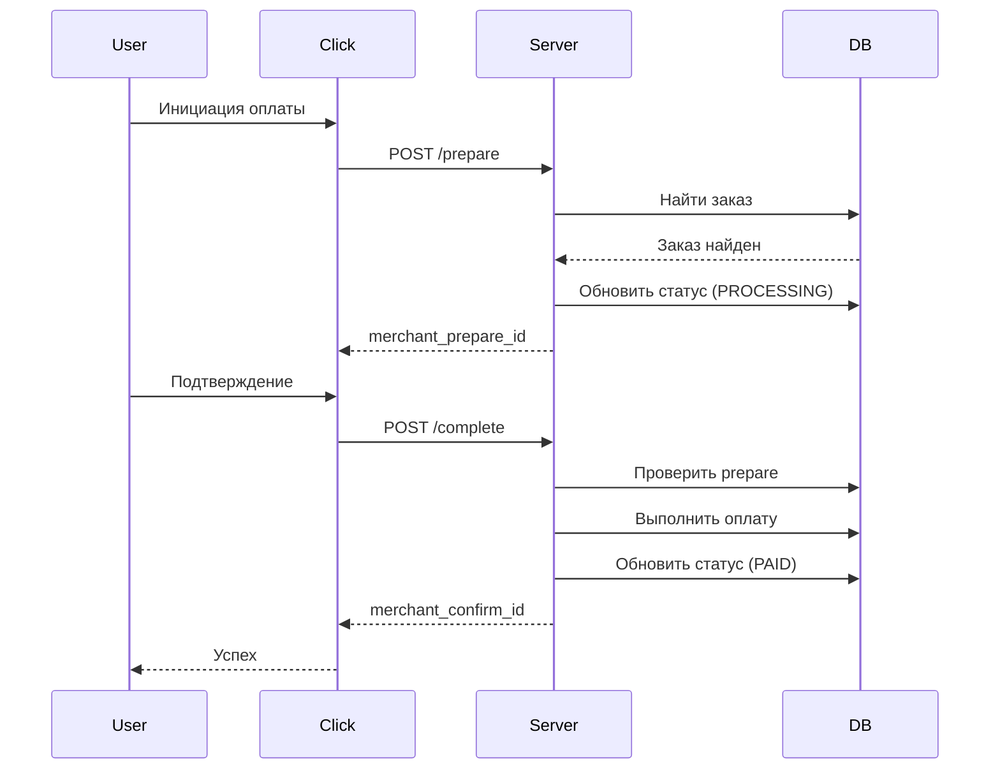

# Click Merchant API Integration

## Обзор

Click — платежная система Узбекистана. Данная документация описывает интеграцию Click Merchant API в систему POSA Activation.

## Конфигурация

### Переменные окружения

```env
CLICK_MERCHANT_ID=your_merchant_id
CLICK_SERVICE_ID=your_service_id
CLICK_SECRET_KEY=your_secret_key
CLICK_USER_ID=your_user_id
```

### Endpoints

```
POST /api/payments/click/prepare
POST /api/payments/click/complete
```

---

## Методы API

### 1. Prepare

Подготовка платежа. Вызывается Click при инициации оплаты.

**Запрос:**
```json
{
    "click_trans_id": 123456,
    "service_id": 12345,
    "click_paydoc_id": 789,
    "merchant_trans_id": "26",
    "amount": 15000,
    "action": 0,
    "error": 0,
    "error_note": "",
    "sign_time": "2024-01-01 12:00:00",
    "sign_string": "md5_hash"
}
```

**Параметры:**
| Параметр | Описание |
|----------|----------|
| click_trans_id | ID транзакции в Click |
| service_id | ID сервиса |
| click_paydoc_id | ID платёжного документа |
| merchant_trans_id | ID заказа в вашей системе |
| amount | Сумма платежа |
| action | 0 = Prepare |
| sign_time | Время подписи |
| sign_string | MD5 подпись |

**Успешный ответ:**
```json
{
    "click_trans_id": 123456,
    "merchant_trans_id": "26",
    "merchant_prepare_id": 26,
    "error": 0,
    "error_note": "Success"
}
```

---

### 2. Complete

Завершение платежа. Вызывается Click после подтверждения оплаты пользователем.

**Запрос:**
```json
{
    "click_trans_id": 123456,
    "service_id": 12345,
    "click_paydoc_id": 789,
    "merchant_trans_id": "26",
    "merchant_prepare_id": 26,
    "amount": 15000,
    "action": 1,
    "error": 0,
    "error_note": "",
    "sign_time": "2024-01-01 12:00:05",
    "sign_string": "md5_hash"
}
```

**Параметры:**
| Параметр | Описание |
|----------|----------|
| action | 1 = Complete |
| merchant_prepare_id | ID из ответа Prepare |

**Успешный ответ:**
```json
{
    "click_trans_id": 123456,
    "merchant_trans_id": "26",
    "merchant_confirm_id": 26,
    "error": 0,
    "error_note": "Success"
}
```

---

## Проверка подписи

Click отправляет подпись для верификации запроса:

```javascript
const crypto = require('crypto');

function verifyClickSignature(params) {
    const {
        click_trans_id,
        service_id,
        secret_key,
        merchant_trans_id,
        amount,
        action,
        sign_time
    } = params;
    
    const signString = `${click_trans_id}${service_id}${secret_key}${merchant_trans_id}${amount}${action}${sign_time}`;
    
    return crypto.createHash('md5').update(signString).digest('hex');
}
```

---

## Коды ошибок

| Код | Константа | Описание |
|-----|-----------|----------|
| 0 | SUCCESS | Успех |
| -1 | SIGN_CHECK_FAILED | Ошибка проверки подписи |
| -2 | WRONG_AMOUNT | Неверная сумма |
| -3 | ACTION_NOT_FOUND | Неверное действие |
| -4 | ALREADY_PAID | Уже оплачено |
| -5 | ORDER_NOT_FOUND | Заказ не найден |
| -6 | TRANSACTION_NOT_FOUND | Транзакция не найдена |
| -7 | CANCEL_ERROR | Ошибка отмены |
| -8 | ACTION_DISABLED | Действие отключено |
| -9 | CANCELLED | Отменено |
| -10 | SYSTEM_ERROR | Системная ошибка |

---

## Формат ответа

Все ответы содержат обязательные поля:

```json
{
    "click_trans_id": 123456,
    "merchant_trans_id": "26",
    "error": 0,
    "error_note": "Success"
}
```

При ошибке:

```json
{
    "click_trans_id": 123456,
    "merchant_trans_id": "26",
    "error": -5,
    "error_note": "Order not found"
}
```

---

## Файлы реализации

| Файл | Описание |
|------|----------|
| `controllers/payment/clickController.js` | Основной контроллер |
| `utils/payment/paymeErrors.js` | Коды ошибок (CLICK_ERRORS) |
| `routes/paymentRoutes.js` | Маршруты API |

---

## Процесс оплаты



---

## Тестирование

### Тестовые данные

Используйте заказы со статусом `PENDING`:

```sql
SELECT id, amount, status 
FROM "QrPaymentAttempt" 
WHERE status = 'PENDING';
```

### Пример curl запроса (Prepare)

```bash
curl -X POST http://localhost:4000/api/payments/click/prepare \
-H "Content-Type: application/json" \
-d '{
    "click_trans_id": 123456,
    "service_id": 12345,
    "click_paydoc_id": 789,
    "merchant_trans_id": "26",
    "amount": 15000,
    "action": 0,
    "error": 0,
    "error_note": "",
    "sign_time": "2024-01-01 12:00:00",
    "sign_string": "computed_md5_hash"
}'
```

---

## Схема базы данных

Транзакции Click также хранятся в таблице `QrPaymentAttempt`:

| Поле | Тип | Описание |
|------|-----|----------|
| id | Int | ID заказа (merchant_trans_id) |
| amount | Float | Сумма в сумах |
| status | Enum | PENDING, PROCESSING, PAID, FAILED |
| externalPaymentId | String? | click_trans_id |
| paymentMethod | String? | "click" |
| createdAt | DateTime | Время создания |
| paidAt | DateTime? | Время оплаты |

---

## Отличия от Payme

| Аспект | Payme | Click |
|--------|-------|-------|
| Протокол | JSON-RPC 2.0 | REST API |
| Авторизация | Basic Auth | MD5 подпись |
| Сумма | В тийинах (×100) | В сумах |
| Методы | 6 методов | 2 метода (prepare/complete) |
| Отмена | CancelTransaction | Через личный кабинет |

---

## Ссылки

- [Официальная документация Click](https://docs.click.uz/)
- [Click Merchant API](https://docs.click.uz/click-api-request/)
